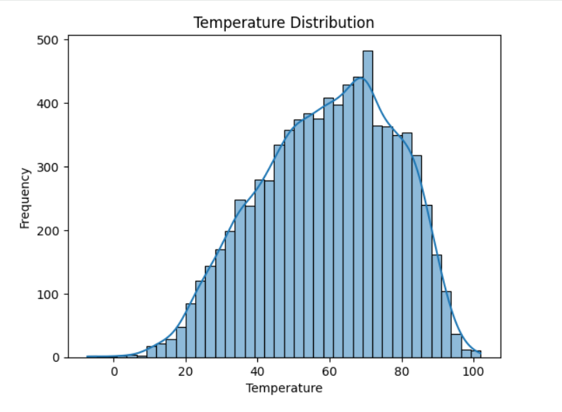
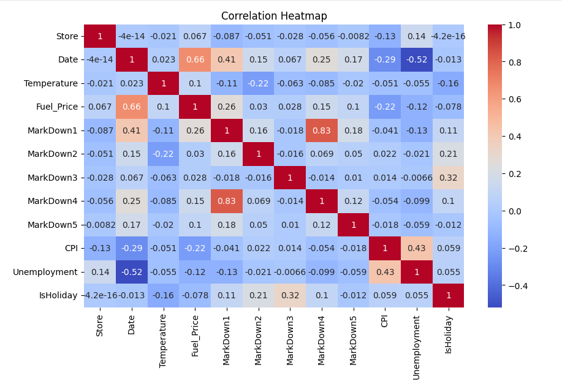

# 📊 Store Data Analysis Project

## 🎯 Project Objective
The objective of this project is to analyze store-related data to identify patterns, relationships, and key factors affecting store conditions using data analysis and visualization techniques.

---

## 📌 Overview
This project focuses on analyzing store data to understand how various variables, including temperature, fuel price, CPI, and unemployment, interact with one another. The goal is to extract meaningful insights and demonstrate data-driven decision-making.

---

## 🛠️ Tools & Technologies
- Python  
- Pandas  
- NumPy  
- Matplotlib  
- Seaborn  
- Scikit-learn  

---

## 📊 Key Analysis
- Data Cleaning & Preprocessing  
- Handling Missing Values  
- Distribution Analysis  
- Correlation Heatmap  
- Basic Machine Learning (Linear Regression)  

---

## 📊 Visualizations

### Distribution Plot

### Correlation Heatmap

These visualizations highlight key patterns and relationships within the dataset.

---

## 🔍 Insights
- Most variables, such as CPI, fuel price, and unemployment, show weak correlation with each other  
- Temperature values are fairly consistent across observations  
- No single factor strongly influences another, indicating multi-factor dependency  
- External economic indicators alone may not fully explain store conditions  

---

## 🤖 Model
A simple Linear Regression model was implemented to understand the relationship between temperature and other variables, such as fuel price, CPI, and unemployment.  

The model was evaluated using Mean Squared Error (MSE), which measures the difference between actual and predicted values.  

Since the dataset does not include sales data, temperature was used as the target variable for demonstration purposes.

---

## 📁 Files
- `Store_Sales_Analysis_Structured_test.ipynb`  
- `features.csv`  

---

## 🚀 Conclusion
The analysis reveals that multiple factors influence store-related conditions, with no single variable having a strong impact. Data visualization and statistical analysis helped uncover patterns and relationships within the dataset.  

Further insights could be derived with more comprehensive data, especially including sales-related variables.

---

## 💡 Key Takeaway
Data-driven analysis helps uncover hidden patterns, but meaningful business insights require the right variables and context.

---
